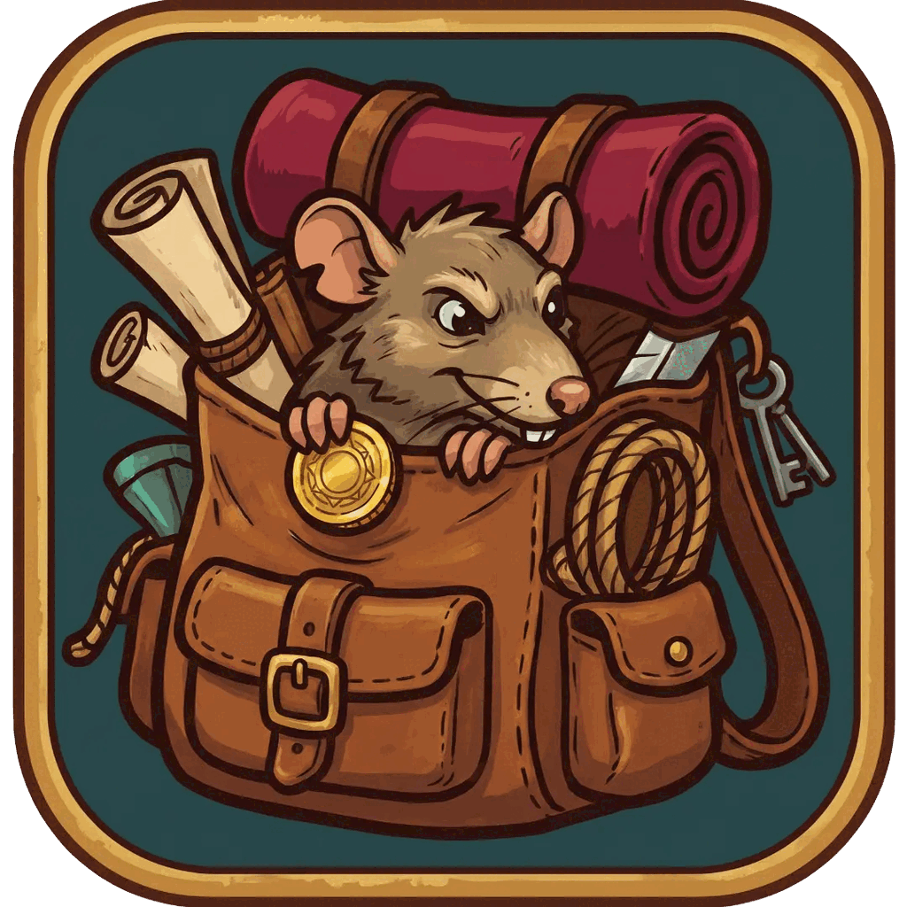

<p align="center"></p>

<h1 align="center">Pack Rat</h1>

Pack Rat is a free app for Ultima Online players. It keeps a list of every item you own, on every character, in every bag, chest and bank box, and it can work out the best suit of gear you could put together from them.

It gets that list from small scripts that you run yourself, inside your own game client. Everything stays on your own computer. The app never sends anything anywhere on its own (the one exception is the "Check for updates" button, and only when you press it — see [PRIVACY.md](PRIVACY.md)).

What you can do with it:

- Search everything you own in one table.
- See what each character is wearing.
- Ask for the best suit your items allow, with the stats you care about.
- Press a button in the app to make the game show you where an item is, walk you to its chest, or put it in your backpack.

## Getting started

> **Not released yet.** Pack Rat has not had its first release. Until it does, the Releases page below is empty and there is nothing to download. These steps are how it will work once it is out.

### 1. Download Pack Rat

1. Go to the [Releases page](https://github.com/gunn4r/uo-pack-rat/releases).
2. Under the newest release, find the file for your computer and click it to download it:

   | Your computer | The file to download |
   |---|---|
   | Mac with an Apple chip (M1, M2, M3, M4…) | `Pack Rat-<version>-mac-arm64.dmg` |
   | Mac with an Intel chip | `Pack Rat-<version>-mac-x64.dmg` |
   | Windows | `Pack Rat-<version>-win-x64.exe` |
   | Linux | `Pack Rat-<version>-linux-x86_64.AppImage` |

   `<version>` is the release number, for example `0.1.0`. Not sure which Mac you have? Click the Apple menu in the top-left corner and choose **About This Mac**. If it says **Chip: Apple M…**, take the Apple chip file. If it says **Processor: … Intel …**, take the Intel file.

The other files on the page are for people who want something different: a `.zip` of each Mac build (unzip it and drag the app into Applications yourself), a `portable` Windows `.exe` that runs without installing, and `SHA256SUMS` (see [Checking a download](#checking-a-download), which is optional).

### 2. Open it for the first time

Pack Rat is not "signed" yet. Signing is a paid certificate that tells your computer who made an app. Without it, your computer will warn you the first time you open Pack Rat. That warning is expected. Here is how to get past it.

**On a Mac:**

1. Double-click the `.dmg` file you downloaded. A window opens.
2. Drag **Pack Rat** into the **Applications** folder in that window.
3. Open your **Applications** folder, then right-click (or hold Control and click) **Pack Rat** and choose **Open**.
4. A box appears with an **Open** button. Click **Open**. You only have to do this the first time.

If there is no **Open** button in that box, click **Done** (or **Cancel**), open **System Settings**, go to **Privacy & Security**, scroll down, and click **Open Anyway** next to the line about Pack Rat.

If your Mac says Pack Rat **"is damaged and can't be opened"**, the app is fine; that is how macOS describes an unsigned download. Open the **Terminal** app (it is in Applications → Utilities), paste this line, press Return, then open Pack Rat again:

```
xattr -dr com.apple.quarantine "/Applications/Pack Rat.app"
```

**On Windows:**

1. Double-click the `.exe` file you downloaded.
2. If a blue box says **"Windows protected your PC"**, click **More info**, then click **Run anyway**.
3. Follow the installer. It asks where to install Pack Rat; the suggested place is fine.
4. Open Pack Rat from the Start menu.

**On Linux:** the AppImage has to be allowed to run first. In a terminal, in the folder you downloaded it to:

```
chmod +x "Pack Rat-<version>-linux-x86_64.AppImage"
./"Pack Rat-<version>-linux-x86_64.AppImage"
```

### 3. The setup window

The first time Pack Rat opens, a setup window walks you through four steps. The top of the window says which step you are on, for example **Step 1 of 4 · Shard**.

1. **Shard.** Pick the shard you play on from the list, then click **Next**.
2. **Client.** Pick the game client you play with. They are listed as **TazUO adapter scripts**, **Razor Enhanced adapter**, and **ClassicUO web client adapter (paste transport)** (the ClassicUO web client is the one you play in a web browser). Click **Next**. Razor Enhanced only works on Windows, so on a Mac or Linux it is shown greyed out.
3. **Locate your client folder.** Pack Rat needs the folder where your game client keeps its scripts.
   - If Pack Rat found it for you, it is listed. Click it.
   - If not, click **Choose a folder…** and pick the folder where your client is installed. For TazUO that is the `TazUO` folder (you can also pick the `LegionScripts` folder inside it). For Razor Enhanced it is the folder you unpacked Razor Enhanced into.
   - When Pack Rat accepts the folder, you will see **Resolved to:** and the folder's location. Click **Next**.
4. **Install.**
   - If the game is running, type `-stopall` in the game's chat and wait for **"No scripts are currently running"**. (Skip this if the game is closed.)
   - Tick **No scripts are running in the client**.
   - Click **Install scripts**.
   - You will see **Installed:** followed by the script names, and a short **What to press in game** list.
   - Click **Finish**.

If you picked the **ClassicUO web client**, steps 3 and 4 are different: there is nothing to install for it. Step 4 has a **Go to Import** button; see [the web client](#the-classicuo-web-client) below.

Every step has a **Skip** button, and skipping is safe. You can run setup again at any time from the **Settings** tab with **Run setup again**.

If you already have scan files from before, step 4 also lets you bring them in: under **Already have scan files? Import a folder**, click **Choose a folder…** and pick the folder they are in.

### 4. You're done when…

- The **Settings** tab, under **Client**, shows your client's name and **installed** with a version number.
- After you run the scanner in the game (next section), your items show up in the **Inventory** tab within a few seconds. You don't have to press anything in the app; it notices new scans by itself.

## Using it in the game

Pack Rat comes with three small scripts. The setup window already put them in your client's scripts folder.

- **`packrat-scanner.py` — the full scan.** Reads everything your character is wearing, your backpack, your bank box if it is open, and every chest and bag near you, including bags inside chests.
- **`packrat-refresh.py` — the quick refresh.** Reads just your stats, skills, what you are wearing and your backpack. Takes a few seconds and works anywhere. (TazUO only.)
- **`packrat-bridge.py` — the bridge.** Makes the **Highlight**, **Grab** and **Go to** buttons in the app work. Start it and leave it running while you use those buttons.

### What to press, and when

- **The first time you scan a character, or when your chests change:** walk to a group of chests and run the scanner. Then walk to the next group and run it again. Do this on each character. To include your bank, open your bank box first.
- **After gearing up or training a character:** run the quick refresh.
- **When you want to find or fetch an item:** start the bridge, then use the buttons next to the item in the app's **Inventory** or **Suit Builder** tab. **Highlight** shows you the item in the game for a few seconds and marks the bag or chest it is in. **Go to** walks you to the chest. **Grab** walks there, opens the chest and puts the item in your backpack. The top of the app shows **bridge: offline** until the bridge is running, then **bridge: *your character* ready**.

### Starting a script in TazUO

1. In the game, open the Script Manager from TazUO's top menu: **Legion Script**.
2. Find the script in the list (for example `packrat-scanner.py`).
3. Press its **Play** button.

To start a script with one key instead, right-click it in the Script Manager, choose **Set Hotkey**, and press the key you want. Pressing that key starts the script, and pressing it again stops it.

### Starting a script in Razor Enhanced

Razor Enhanced runs only on Windows. It has the scanner and the bridge, but no quick refresh.

1. In Razor Enhanced, open the **Scripts** tab.
2. If `packrat-scanner.py` and `packrat-bridge.py` are not in the list yet, add them.
3. Pick the script and start it, the same way as any other Razor Enhanced script. You can give it a hotkey there too.

This one has not been tried with a real game yet. If something goes wrong, please [open an issue](https://github.com/gunn4r/uo-pack-rat/issues) and say what you saw. More in [adapters/razor-enhanced/README.md](adapters/razor-enhanced/README.md).

### The ClassicUO web client

The web client can't save files, so it works differently: you copy and paste.

1. Open [adapters/classicuo-web/packrat-scanner.ts](adapters/classicuo-web/packrat-scanner.ts), copy all of it, and paste it into the web client's scripting window as a new script.
2. Stand near what you want scanned and run the script.
3. It prints a block of text below the scripting window, starting with `-----BEGIN PACK RAT SCAN-----` and ending with `-----END PACK RAT SCAN-----`. Select all of it and copy it.
4. In Pack Rat, open **Import** in the sidebar (or press ⌘I, Ctrl+I on Windows and Linux), paste into the box under **Paste a scan**, and click **Paste scan**.

The web client can't see your bank box, probably can't see what you wear on your arms, and only finds common kinds of chests and bags. It also has no bridge, so the Highlight, Grab and Go to buttons don't appear for it. It has not been tried with a real game yet either. More in [adapters/classicuo-web/README.md](adapters/classicuo-web/README.md).

### These scripts are for when you are at the keyboard

The scripts only read what your character can see, and they only move an item when you click a button in the app. They never fight, gather or loot, and they don't keep doing things while you are away. That matters: most shards, including the one Pack Rat was made for, ban unattended fighting, gathering and looting, sometimes with harsh penalties. Check your own shard's rules before you run any script.

## Keep your scan files to yourself

A scan file lists everything a character owns. It also records **where your character was standing and where each scanned chest is** — which usually means **the location of your house**, and which chest holds your best gear.

Don't post a scan file in public (a forum, Discord, or a GitHub issue) without opening it and looking at it first. If you need help with a problem, describe it and ask what to send. [PRIVACY.md](PRIVACY.md) has the full list of what a scan contains.

## Help, something isn't working

**The setup window can't find my scripts folder.**
That is normal for Razor Enhanced, and it happens for TazUO when it is installed somewhere unusual. Click **Choose a folder…** and pick the folder your client is installed in (for TazUO, the `TazUO` folder or the `LegionScripts` folder inside it). If Pack Rat says the folder isn't right, try the folder one level up or one level down.

**The Grab button says "Bridge is offline".**
The bridge script isn't running. In the game, start `packrat-bridge.py` and leave it running, then wait a few seconds until the top of the app says **bridge: *your character* ready**. The bridge stops on its own after 8 hours; just start it again.

**Pack Rat says my game scripts write to another folder.**
The scripts in your game client save scans to one folder and Pack Rat is reading a different one, so nothing you scan shows up and the bridge looks offline. In the **Settings** tab, type `-stopall` in the game first, then tick **No scripts are running in the client** and click **Reinstall scripts**: the scripts will then write to the folder Pack Rat reads. (Running from source? Start it on the scripts' folder instead: `npm start -- --data <the folder the message names>`.)

**Pack Rat says a script is still running, or tells me to type `-stopall`.**
Pack Rat won't replace the scripts while one of them is running in the game. In the game's chat, type `-stopall` and wait for **"No scripts are currently running"**. Then go back, tick **No scripts are running in the client**, and try again.

**I ran the scanner but nothing showed up.**
If Pack Rat was closed while you scanned, open it: it picks up scans it missed when it starts. Otherwise, look in the **Settings** tab: under **Client**, it should say **installed**. If you moved your game client, or if the app says it can't find the client folder any more, click **Run setup again** and point it at the new place. If a scan file can't be read, Pack Rat puts it aside in a `rejected` folder inside your data folder, with a note next to it saying why.

**A chest didn't get scanned.**
The scanner only reads chests close to you that it can open. Stand closer and run it again. Bags that won't open are kept as they were last time rather than being emptied.

**How do I get new versions of the scripts?**
When you update Pack Rat, update the scripts too: type `-stopall` in the game, then in the **Settings** tab tick **No scripts are running in the client** and click **Reinstall scripts**.

**Where is my data?**
In the **Settings** tab, next to **Data directory**, click **Open**. Everything Pack Rat knows is in that one folder. To back it up, copy the folder. Deleting it deletes everything; there is no other copy. See [Your data](#your-data) below.

**Is there a newer version of Pack Rat?**
In the **Settings** tab, click **Check for updates**. If there is one, a **View release** link takes you to it.

Still stuck? [Open an issue](https://github.com/gunn4r/uo-pack-rat/issues) and describe what you did and what you saw (but see [Keep your scan files to yourself](#keep-your-scan-files-to-yourself) before attaching anything).

## Your data

Everything the app knows lives in one folder on your computer:

| Computer | Folder |
|---|---|
| Mac | `~/Library/Application Support/Pack Rat` |
| Windows | `%APPDATA%\Pack Rat` |
| Linux | `~/.config/Pack Rat` |

[PRIVACY.md](PRIVACY.md) explains exactly what is stored there.

## Checking a download

This is optional. Every release has a `SHA256SUMS` file that lets you check your download is exactly the file this project published. It is worth doing if you got Pack Rat from anywhere other than the Releases page (a Discord post, a forum, someone else's link). [RELEASING.md's "Verifying a download"](RELEASING.md#verifying-a-download) has the steps.

## For developers

The rest of this page is for people working on Pack Rat itself.

**Status.** No tagged version has been published yet — see `RELEASING.md` for how one gets cut. The app itself is functional end to end (inventory, suit builder, the setup wizard, the packaging and CI that will build the installers above), but until the first release is tagged there is nothing on the Releases page to download. The installers are unsigned; `SECURITY.md` and `RELEASING.md`'s "Before 1.0" section say why and what signing would change.

**Developing.** See `CONTRIBUTING.md` for the dev loop, the module layout, and the app's external contracts (scan files, the bridge protocol, shard rules). Run the desktop app with `npm run desktop`, the bare server with `npm start -- --open`, and the tests with `npm test` — see `TESTING.md` for the tag scheme and what each test file covers.

**Adapters and contracts.** Each client's scripts live in `adapters/<id>/`, and each adapter's README has a player section followed by its own "For developers" section (contract, what the bridge refuses, data-directory resolution, limits, what is still unverified): [TazUO](adapters/tazuo/README.md), [Razor Enhanced](adapters/razor-enhanced/README.md), [ClassicUO web client](adapters/classicuo-web/README.md). The contracts themselves are in `docs/`: [writing an adapter](docs/adapter-guide.md), [the scan file format](docs/scan-schema.md), [the bridge protocol](docs/bridge-protocol.md), [shard rules](docs/shard-rules.md), and [the threat model](docs/threat-model.md).

**The setup wizard, in detail.** For TazUO it proposes candidate folders it finds automatically; Razor Enhanced has no single well-known install location, so its folder is always picked by hand; the ClassicUO web client (paste transport) has no folder to locate at all and sends the player to the Import drawer instead. Install and Reinstall refuse while `<dataDir>/bridge/<adapter>/status.json` says a script is still alive in the client. `docs/architecture.md` has the full install path.

## License

MIT — see `LICENSE`. The bundled IBM Plex Sans and IBM Plex Mono fonts (`app/ui/fonts/`) are © IBM Corp. under the SIL Open Font License 1.1; their licence texts sit next to them.
